# Сети в Linux

## Part 1. Инструмент ipcalc

### 1.1 Сети и маски

*************************************************************************************************************************
- Определение адреса сети 192.167.38.54/13: ipcalc 192.167.38.54/13

> Результат выполнения команды ipcalc 192.167.38.54/13
*************************************************************************************************************************
- Для перевода маски 255.255.255.0 в префиксную и двоичную запись выполним команду: ipcalc 255.255.255.0

> Перевод маски 255.255.255.0 в префиксную и двоичную запись
*************************************************************************************************************************
- Для перевода /15 в обычную и двоичную запись выполним команду: ipcalc /15

> Перевод маски /15 в обычную и двоичную запись
*************************************************************************************************************************
- Для перевода 11111111.11111111.11111111.11110000 в обычную и префиксную запись выполним команду: ipcalc 255.255.255.240

> Перевод 11111111.11111111.11111111.11110000 в обычную и префиксную запись
*************************************************************************************************************************
- Минимальный и максимальный хост в сети 12.167.38.4 при маске: /8

>Минимальный хост 12.0.0.1. Максимальный хост: 12.255.255.254
*************************************************************************************************************************
- Минимальный и максимальный хост в сети 12.167.38.4 при маске: 11111111.11111111.00000000.00000000

>Минимальный хост 12.0.0.1. Максимальный хост: 12.255.255.254
*************************************************************************************************************************
- Минимальный и максимальный хост в сети 12.167.38.4 при маске: 255.255.254.0

>Минимальный хост 12.167.38.1. Максимальный хост: 12.167.39.254
*************************************************************************************************************************
- Минимальный и максимальный хост в сети 12.167.38.4 при маске: /4
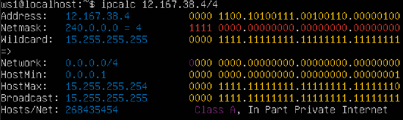

>Минимальный хост 0.0.0.1. Максимальный хост: 15.255.255.254
*************************************************************************************************************************

### 1.2 localhost

- Определяем, можно ли обратиться к приложению, работающему на localhost, со следующими IP: 194.34.23.100, 127.0.0.2, 127.1.0.1, 128.0.0.1 с помощью команды ping
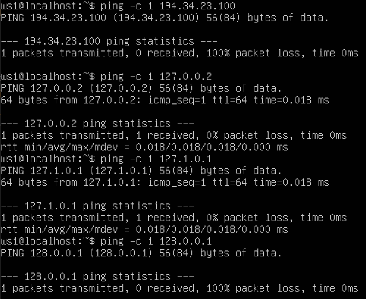

>Можно обратиться к 127.0.0.2 и 127.1.0.1. Пакеты с IP 194.34.23.100 и 128.0.0.1 - 100% packet loss
*************************************************************************************************************************

### 1.3 Диапазоны и сегменты сетей

- Определяем публичные и частные ip 10.0.0.45, 134.43.0.2, 192.168.4.2, 172.20.250.4, 172.0.2.1, 192.172.0.1, 172.68.0.2, 172.16.255.255, 10.10.10.10, 192.169.168.1 с помощью ipcalc

> Частные адреса: 10.0.0.45, 192.168.4.2, 172.20.250.4, 172.16.255.255, 10.10.10.10. 
> Публичные адреса: 134.43.0.2, 172.0.2.1, 192.172.0.1, 172.68.0.2, 192.169.168.1.
*************************************************************************************************************************
- Определим какие из перечисленных IP адресов шлюза возможны у сети 10.10.0.0/18: 10.0.0.1, 10.10.0.2, 10.10.10.10, 10.10.100.1, 10.10.1.255

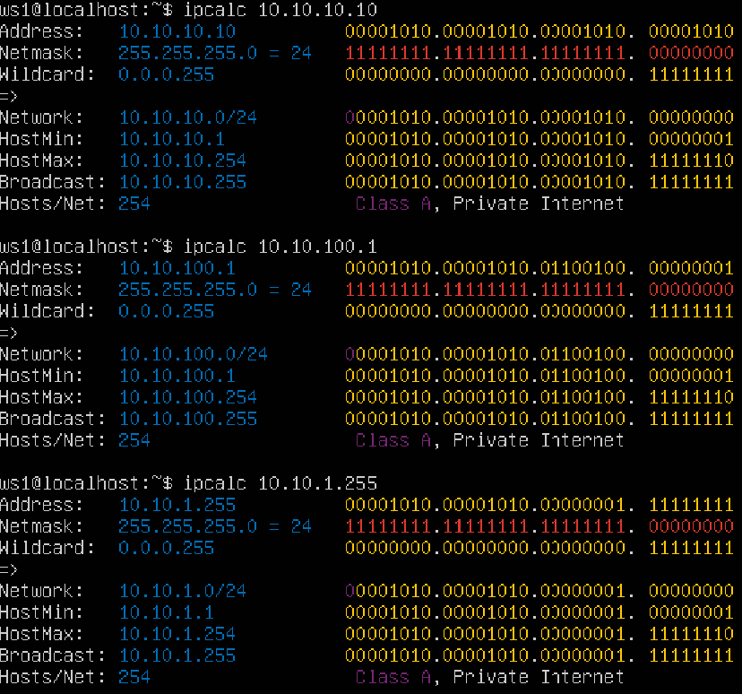

> Из перечисленных IP-адресов шлюза, только 10.10.0.2 и 10.10.1.255 возможны для сети 10.10.0.0/18. 10.0.0.1, 10.10.10.10 и 10.10.100.1 не входят в диапазон адресов данной сети. 
*************************************************************************************************************************

## Part 2. Статическая маршрутизация между двумя машинами

*************************************************************************************************************************
- Выполним ip -a для ws1 и ws2
- ws1:

- ws2:

*************************************************************************************************************************
- Изменим файлы etc/netplan/00-installer-config.yaml, пропишем IP для ws1 и ws2 и выполним netplan apply для перезапуска сервиса сети
- ws1:
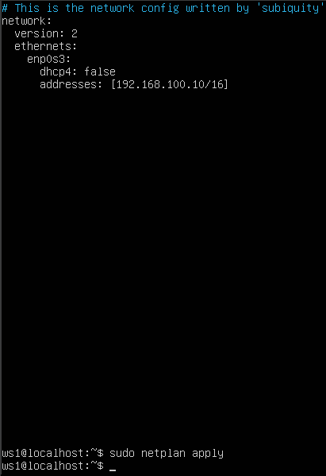
- ws2:
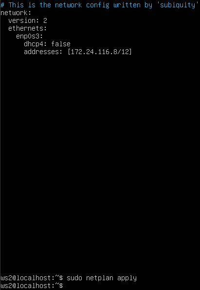

*************************************************************************************************************************

### 2.1. Добавление статического маршрута вручную
- Добавим статический маршрут от одной машины до другой и обратно при помощи команды вида ip r add
Пропингуем соединение между машинами

- ws1 -> ws2:

- ws2 -> ws1:

### 2.2. Добавление статического маршрута с сохранением
- Добавим статический маршрут от одной машины до другой с помощью файла etc/netplan/00-installer-config.yaml
- ws1:

- ws2:

- Пропингуем:
- ws1 -> ws2:

- ws2 -> ws1:

## Part 3. Утилита iperf3

### 3.1 Скорость соединения

- 8 Mbps = 1 MB/s
- 100 MB/s = 819200 Kbps
- 1 Gbps = 1024 Mbps

### 3.2. Утилита iperf3

- Измерим скорость соединения между ws1 и ws2

## Part 4. Сетевой экран

### 4.1 Утилита iptables

- Содержание файлов /etc/firewall.sh + chmod +x /etc/firewall.sh запуск /etc/firewall.sh и ping между машинами ws1 и ws2:

### 4.2 Утилита nmap

Командой ping найдём машину, которая не пингуется, после чего утилитой nmap посмотрим, что хост машины запущен
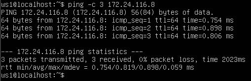
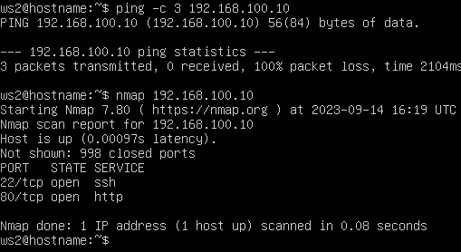

*************************************************************************************************************************

## Part 5. Статическая маршрутизация сети

### 5.1 Настройка адресов машин

Настроим конфигурации машин в etc/netplan/00-installer-config.yaml согласно сети на рисунке.

Отредактируем содержание файлов etc/netplan/00-installer-config.yaml для каждой машины.
- r1:

- ws21:

- r2:

- ws22:

- ws11:

*************************************************************************************************************************
- Командой ip -4 a проверим, что адреса машин заданы верно. 

- Пропингуем ws22 с ws21.

- Пропингуем r1 с ws11.

### 5.2 Включение переадресации IP-адресов

Для включения переадресации IP, выполним команду на роутерах: sysctl -w net.ipv4.ip_forward=1
При таком подходе переадресация не будет работать после перезагрузки системы.

*************************************************************************************************************************
Откроем файлы /etc/sysctl.conf и раскомментируем строки:
net.ipv4.ip_forward = 1
При использовании этого подхода, IP-переадресация включится на постоянной основе.

### 5.3 Установка маршрута по-умолчанию

Настроим маршруты по-умолчанию (шлюз) для рабочих станций. Для этого добавим default перед IP роутера в файлах конфигураций.

*************************************************************************************************************************
Пропингуем с ws11 роутер r2 и посмотрим на r2, что пинг доходит. Для этого используем команду: `tcpdump -tn -i eth1` на r2
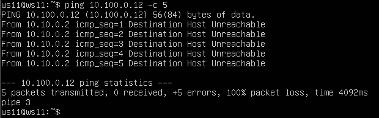

### 5.4 Добавление статических маршрутов

Добавим в роутеры r1 и r2 статические маршруты в файле конфигураций etc/netplan/00-installer-config.yaml. Вызовем ip r и посмотрим таблицы с маршрутами на обоих роутерах. 

*************************************************************************************************************************

### 5.5 Построение списка маршрутизаторов

Запустим на r1 команду дампа: tcpdump -tnv -i eth0
При помощи утилиты traceroute построим список маршрутизаторов на пути от ws11 до ws21

### 5.6 Использование протокола ICMP при маршрутизации

Запустим на r1 перехват сетевого трафика, проходящего через eth0 с помощью команды: `tcpdump -n -i eth0 icmp`

Пропингуем с ws11 несуществующий IP (например, 10.30.0.111) с помощью команды: `ping -c 1 10.30.0.111`
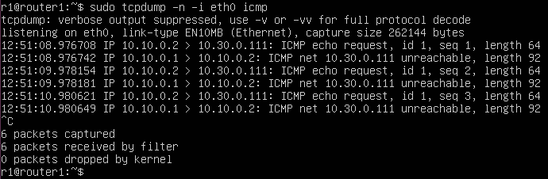

## Part 6. Динамическая настройка IP с помощью DHCP

Для r2 настроим в файле /etc/dhcp/dhcpd.conf конфигурацию службы DHCP:
Укажем адрес маршрутизатора по-умолчанию, DNS-сервер и адрес внутренней сети.
В файле /etc/resolv.conf пропишем nameserver 8.8.8.8.
Перезагрузим службу DHCP командой systemctl restart isc-dhcp-server. 

*************************************************************************************************************************
Машину ws21 перезагрузим при помощи reboot и через ip a покажем, что она получила адрес. Также пропингуем ws22 с ws21.

*************************************************************************************************************************
Указажем/изменим MAC адрес у ws11, для этого в etc/netplan/00-installer-config.yaml добавим (изменим) строки: macaddress: 10:10:10:10:10:BA, dhcp4: true

*************************************************************************************************************************
Для r1 настроим в файле /etc/dhcp/dhcpd.conf конфигурацию службы DHCP:
Укажем адрес маршрутизатора по-умолчанию, DNS-сервер и адрес внутренней сети.
В файле /etc/resolv.conf пропишем nameserver 8.8.8.8.
Перезагрузим службу DHCP командой systemctl restart isc-dhcp-server. 

*************************************************************************************************************************
Машину ws11 перезагрузим при помощи reboot и через ip a покажем, что она получила адрес. Также пропингуем ws22 с ws11.

*************************************************************************************************************************
Указажем/изменим MAC адрес у ws11, для этого в etc/netplan/00-installer-config.yaml добавим (изменим) строки: macaddress: 10:10:10:10:10:BA, dhcp4: true

*************************************************************************************************************************
Вызовем ip a для просмотра текущего IP. Поправим для ws21 файлы /etc/dhcp/dhcpd.conf, /etc/resolv.conf для настройки получения динамического IP машиной. Выполним команду dhclient -v для запроса нового IP. 

Сохраним дампы образов виртуальных машин.

## Part 7. NAT

В файлах /etc/apache2/ports.conf на ws22 и r1 изменим строку Listen 80 на Listen 0.0.0.0:80, то есть сделаем сервер Apache2 общедоступным
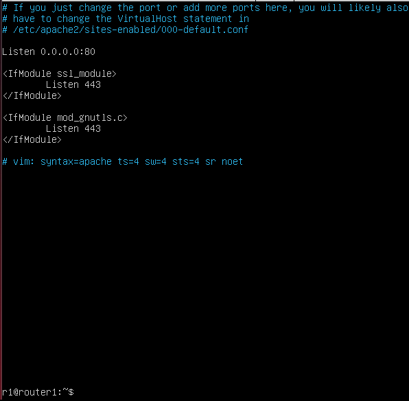
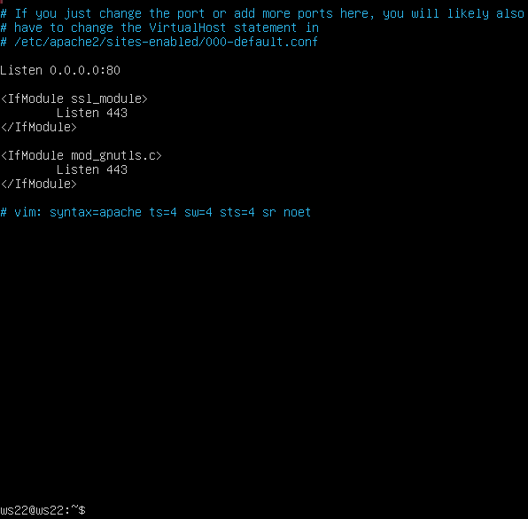

*************************************************************************************************************************
Запустим веб-серверы Apache командой service apache2 start на ws22 и r1

*************************************************************************************************************************
Добавим в фаервол, созданный по аналогии с фаерволом из Части 4, на r2 следующие правила:
1) удаление правил в таблице filter - iptables -F
2) удаление правил в таблице "NAT" - iptables -F -t nat
3) отбрасывать все маршрутизируемые пакеты - iptables --policy FORWARD DROP

*************************************************************************************************************************
Проверим соединение между ws22 и r1 командой ping
При запуске файла с этими правилами, ws22 не должна "пинговаться" с r1

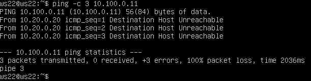

*************************************************************************************************************************
Разрешим маршрутизацию всех пакетов протокола ICMP

*************************************************************************************************************************
Проверим соединение между ws22 и r1 командой ping

*************************************************************************************************************************
Добавим в файл ещё два правила:
- включим SNAT, а именно маскирование всех локальных ip из локальной сети, находящейся за r2
- включим DNAT на 8080 порт машины r2 и добавить к веб-серверу Apache, запущенному на ws22, доступ извне сети

*************************************************************************************************************************
Проверим соединение по TCP для SNAT, для этого с ws22 подключимся к серверу Apache на r1

*************************************************************************************************************************
Проверим соединение по TCP для DNAT, для этого с r1 подключимся к серверу Apache на ws22 командой telnet (по адресу r2 и порту 8080)

*************************************************************************************************************************
Сохраним дампы образов виртуальных машин

## Part 8*. Знакомство с SSH Tunnels

Запустим на r2 фаервол с правилами из Части 7

*************************************************************************************************************************
Запустим веб-сервер Apache на ws22 только на localhost (то есть в файле /etc/apache2/ports.conf изменим строку Listen 80 на Listen localhost:80)

*************************************************************************************************************************
Воспользуемся Local TCP forwarding с ws21 до ws22, чтобы получить доступ к веб-серверу на ws22 с ws21. 
ssh -L [local_port]:localhost:80 [remote_ip]

Для выхода необходимо набрать EXIT в терминале
*************************************************************************************************************************
Воспользуемся Remote TCP forwarding c ws11 до ws22, чтобы получить доступ к веб-серверу на ws22 с ws11
ssh -R [remote_port]:localhost:80 [remote_ip]

Для выхода необходимо набрать EXIT в терминале
*************************************************************************************************************************
Для проверки, сработало ли подключение в обоих предыдущих пунктах, перейдем во второй терминал клавишами Alt + F2 и выполним команду:
telnet 127.0.0.1 80

*************************************************************************************************************************
Сохраним дампы образов виртуальных машин
